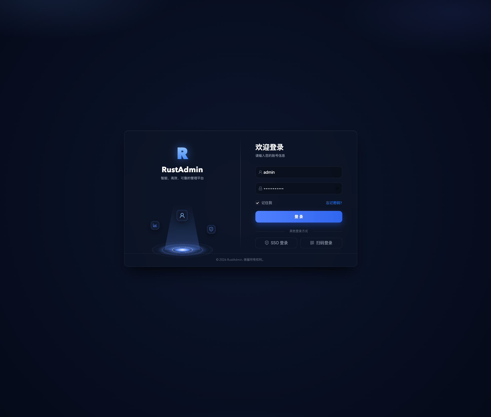
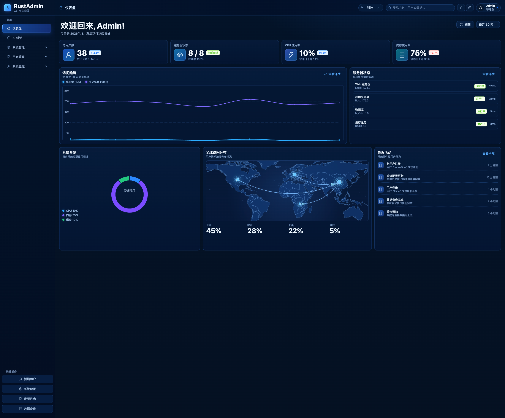

# RustAdmin

Rust + React + Ant Design 的后台管理系统模板，覆盖登录、仪表盘、系统管理、日志、监控、AI 对话（Mock）等常见后台能力，适合作为企业后台脚手架进行二次开发。

## 项目特性

- 后端：Rust + Axum + SQLx + MySQL + Redis
- 前端：React + TypeScript + Ant Design + ECharts
- 模块化设计：`auth / dashboard / system / log / monitor / ai`
- 多主题支持：`明亮 / 暗黑 / 科技`
- 菜单到按钮级权限控制（RBAC + `permission` 权限码）
- 系统管理统一 CRUD（用户、角色、菜单、部门、岗位、字典、参数、通知）
- 监控模块（在线用户、定时任务、数据源、服务、缓存搜索）

## 项目结构

```text
rust-admin/
├─ admin-api/                 # Rust 后端服务
├─ admin-web/                 # React 前端应用
├─ sql/                       # MySQL schema 与 seed
```

## 系统截图

### 登录页



### 首页（仪表盘）



## 快速开始

### 1. 启动基础依赖

- MySQL 8.x
- Redis 7.x

### 2. 初始化数据库

```bash
mysql -uroot -p < sql/rust_admin_20260403.sql
```

### 3. 启动后端

```bash
cd admin-api
cp .env.example .env
# 编辑 .env，设置 APP_ENV（通常是 dev）
APP_ENV=dev cargo run
```

健康检查：

```bash
curl http://127.0.0.1:8080/health
```

### 4. 启动前端

```bash
cd admin-web
npm install
npm run dev
```

访问：`http://127.0.0.1:5173`

## 默认账号

- 用户名：`admin`
- 密码：`admin123456`

> 仅用于开发环境演示。上线前请务必修改默认账号密码与 JWT 密钥。

## 开发命令

后端：

```bash
cd admin-api
cargo fmt --all
cargo clippy --all-targets --all-features -- -D warnings
cargo test --all --all-features
```

前端：

```bash
cd admin-web
npm run typecheck
npm run build
```

权限相关文档：

- 方案与阶段任务：[`docs/button-level-permission-control-plan.md`](./docs/button-level-permission-control-plan.md)
- 上线与回滚：[`docs/permission-release-rollback.md`](./docs/permission-release-rollback.md)

## 开源协作

- 贡献指南：[`CONTRIBUTING.md`](./CONTRIBUTING.md)
- 行为准则：[`CODE_OF_CONDUCT.md`](./CODE_OF_CONDUCT.md)
- 安全策略：[`SECURITY.md`](./SECURITY.md)
- 发布清单：[`docs/open-source-checklist.md`](./docs/open-source-checklist.md)

## Star 趋势

[](https://www.star-history.com/#wangyakun/rust-admin&Date)

## License

本项目采用 [`MIT License`](./LICENSE)。
